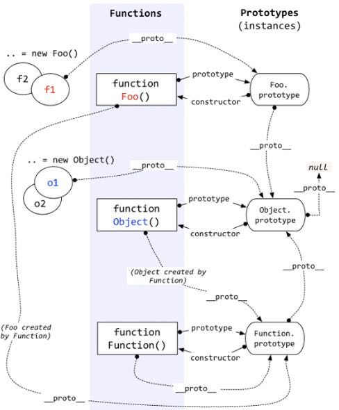

# JS

### 1.原型 / 构造函数 / 实例

- 原型
   -  
    - `Object`是所有对象的爸爸，所有对象都可以通过` __proto__`找到它
    

    - `Function`是所有函数的爸爸，所有函数都可以通过` __proto__`找到它

    - `Function.prototype`和`Object.prototype`是两个特殊的对象，他们由引擎来创建

    - 除了以上两个特殊对象，其他对象都是通过构造器`new`出来的

    - 函数的`prototype`是一个对象，也就是原型

    - 对象的` __proto__`指向原型，`__proto__ `将对象和原型连接起来组成了原型链

    - 原型`(prototype)`: 一个简单的对象，用于实现对象的 属性继承。可以简单的理解成对象的爹。在 Firefox 和 Chrome 中，每个JavaScript对象中都包含一个`__proto__` (非标准)的属性指向它爹(该对象的原型)，可`obj.__proto__`进行访问。

    - 构造函数: 可以通过`new`来 新建一个对象 的函数。

    - 实例: 通过构造函数和new创建出来的对象，便是实例。 实例通过`__proto__`指向原型，通过`constructor`指向构造函数。

    - [实例](https://user-gold-cdn.xitu.io/2019/2/14/168e9d9b940c4c6f?imageView2/0/w/1280/h/960/format/webp/ignore-error/1)

### 2.原型链

- **原型链是由原型对象组成**，每个对象都有` __proto__` 属性，指向了创建该对象的构造函数的原型，`__proto__` 将对象连接起来组成了原型链。是一个用来实现继承和共享属性的有限的对象链。

### 3.执行上下文

- 类型
   - 全局执行上下文
   - 函数执行上下文
   - `eval`执行上下文

- 包含三个部分
   - 变量对象
   - 作用域链
   - `this`指向
  
- 代码执行过程
   - 创建全局上下文
   - 全局上下文自上而下执行代码
   - 遇到函数时，被`push`到执行栈中顶层
   - 开始执行函数中的代码
   - 函数执行完成后`pop`移除栈，全局上下文继续执行

### 4.闭包

- 闭包的定义很简单：函数 A 返回了一个函数 B，并且函数 B 中使用了函数 A 的变量，函数 B 就被称为闭包。
- 父函数被销毁 的情况下，返回出的子函数的`[[scope]]`中仍然保留着父级的单变量对象和作用域链，因此可以继续访问到父级的变量对象，这样的函数称为闭包。

- 闭包会产生一个很经典的问题:
   - 多个子函数的`[[scope]]`都是同时指向父级，是完全共享的。因此当父级的变量对象被修改时，所有子函数都受到影响。

- 解决：
   - 变量可以通过**函数参数的形式**传入，避免使用默认的`[[scope]]`向上查找
   - 使用`setTimeout`包裹，通过第三个参数传入
   - 使用**块级作用域**，让变量成为自己上下文的属性，避免共享

###  5.script的引入方式

- `<script defer>`: 立即请求文件，但不阻塞渲染引擎，而是文件加载完毕后阻塞渲染引擎并立即执行文件内容。

- `<script async>`: 立即请求文件，但不阻塞渲染引擎，等到解析完 HTML 之后再执行文件内容。

- **HTML5 标准 type 属性**：对应值为“module”。让浏览器按照 ECMA Script 6 标准将文件当作模块进行解析，默认阻塞效果同 defer，也可以配合 async 在请求完成后立即执行。

###  6.赋值、浅拷贝和深拷贝的区别

- 赋值是将某一数值或对象赋给某个变量的过程

   - 基本数据类型：赋值，赋值之后两个变量互不影响
   - 引用数据类型：赋址，两个变量具有相同的引用，指向同一个对象，相互之间有影响

- 浅拷贝

   - 创建一个新对象，这个对象有着原始对象属性值的一份精确拷贝。如果属性是基本类型，拷贝的就是基本类型的值，如果属性是引用类型，拷贝的就是内存地址 ，所以如果其中一个对象改变了这个地址，就会影响到另一个对象。

   - `Object.assign()`: 用于将所有可枚举属性的值从一个或多个源对象复制到目标对象。它将返回目标对象。

   - 展开语法

   - `Array.prototype.slice()`

- 深拷贝

   - 深拷贝: 完全拷贝一个新对象，修改时原对象不再受到任何影响

   - `JSON.parse(JSON.stringify(object))`: 
    
      - 会忽略`undefined`
      - 会忽略`symbol`
      - 不能序列化函数
      - 不能解决循环引用的对象
      - 不能正确处理new Date()
      - 不能处理正则
      - `undefined`、`symbol` 和函数这三种情况，会直接忽略。
   - 递归进行逐一赋值

### 7.`new`

   - 创建一个用户定义的对象类型的实例或具有构造函数的内置对象的实例
   - `bind`返回的是一个新的函数，你必须调用它才会被执行
   - `call, apply` 会执行函数

- `instanceof`

   - `instanceof`可以正确的判断对象的类型，因为内部机制是通过判断对象的原型链中是不是能找到类型的`prototype`

### 8.`this`

   - 绑定规则
      - 默认绑定
         - 独立函数调用，可以把默认绑定看作是无法应用其他规则时的默认规则，`this`指向全局对象
         - 严格模式下，不能将全局对象用于默认绑定，`this`会绑定到`undefined`。只有函数运行在非严格模式下，默认绑定才能绑定到全局对象。在严格模式下调用函数则不影响默认绑定。
            - ```
                function foo() { // 运行在严格模式下，this会绑定到undefined
                    "use strict";
                    
                    console.log( this.a );
                }

                var a = 2;

                // 调用
                foo(); // TypeError: Cannot read property 'a' of undefined

                // --------------------------------------

                function foo() { // 运行
                    console.log( this.a );
                }

                var a = 2;

                (function() { // 严格模式下调用函数则不影响默认绑定
                    "use strict";
                    
                    foo(); // 2
                })();
               ```

      - 隐式绑定
         - 当函数引用有上下文对象时，隐式绑定规则会把函数中的this绑定到这个上下文对象。对象属性引用链中只有上一层或者说最后一层在调用中起作用。
            - ```
                function foo() {
                    console.log( this.a );
                }

                var obj = {
                    a: 2,
                    foo: foo
                };

                obj.foo(); // 2
              ```
         - 隐式丢失
            - 隐式绑定的函数特定情况下会丢失绑定对象，应用默认绑定，把`this`绑定到全局对象或者`undefined`上。
               - ```
                    // 虽然bar是obj.foo的一个引用，但是实际上，它引用的是foo函数本身。
                    // bar()是一个不带任何修饰的函数调用，应用默认绑定。
                    function foo() {
                        console.log( this.a );
                    }

                    var obj = {
                        a: 2,
                        foo: foo
                    };

                    var bar = obj.foo; // 函数别名

                    var a = "oops, global"; // a是全局对象的属性

                    bar(); // "oops, global"
                 ``` 
            - 参数传递就是一种隐式赋值，传入函数时也会被隐式赋值。回调函数丢失this绑定是非常常见的。
               - ```
                    function foo() {
                        console.log( this.a );
                    }

                    function doFoo(fn) {
                        // fn其实引用的是foo
                        
                        fn(); // <-- 调用位置！
                    }

                    var obj = {
                        a: 2,
                        foo: foo
                    };

                    var a = "oops, global"; // a是全局对象的属性

                    doFoo( obj.foo ); // "oops, global"

                    // ----------------------------------------

                    // JS环境中内置的setTimeout()函数实现和下面的伪代码类似：
                    function setTimeout(fn, delay) {
                        // 等待delay毫秒
                        fn(); // <-- 调用位置！
                    }
                 ```
         - 显式绑定
        
           - 通过`call(..)`或者`apply(..)`方法。第一个参数是一个对象，在调用函数时将这个对象绑定到`this`。因为直接指定`this`的绑定对象，称之为显示绑定。
              - ```
                function foo() {
                    console.log( this.a );
                }

                var obj = {
                    a: 2
                };

                foo.call( obj ); // 2  调用foo时强制把foo的this绑定到obj上
                ```

         - `new`绑定
            - 使用`new`来调用`foo(..)`时，会构造一个新对象并把它`(bar)`绑定到`foo(..)`调用中的`this`。
               - ```
                    function foo(a) {
                        this.a = a;
                    }

                    var bar = new foo(2); // bar和foo(..)调用中的this进行绑定
                    console.log( bar.a ); // 2
                 ```
         - 箭头函数
            - 根据外层（函数或者全局）作用域（词法作用域）来决定`this`
            - 箭头函数的绑定无法被修改
               - ```
                    function foo() {
                        // 返回一个箭头函数
                        return (a) => {
                            // this继承自foo()
                            console.log( this.a );
                        };
                    }

                    var obj1 = {
                        a: 2
                    };

                    var obj2 = {
                        a: 3
                    }

                    var bar = foo.call( obj1 );
                    bar.call( obj2 ); // 2，不是3！
                 ```
            - ES6之前和箭头函数类似的模式，采用的是词法作用域取代了传统的`this`机制。
               - ```
                    function foo() {
                        var self = this; // lexical capture of this
                        setTimeout( function() {
                            console.log( self.a ); // self只是继承了foo()函数的this绑定
                        }, 100 );
                    }

                    var obj = {
                        a: 2
                    };

                    foo.call(obj); // 2
                 ```
###  9.类型转换

   - 转Boolean

      - 在条件判断时，除了`undefined`， `null`，`false`，`NaN`，`''`，`0`，`-0`，其他所有值都转为`true`，包括所有对象。
   - 对象转基本类型

      - 对象在转换基本类型时，首先会调用`valueOf`然后调用`toString`。并且这两个方法你是可以重写的。
      - 可以重写`Symbol.toPrimitive`，该方法在转基本类型时调用优先级最高。
         - ```
            let a = {
                valueOf() {
                    return 0;
                },
                toString() {
                    return '1';
                },
                [Symbol.toPrimitive]() {
                    return 2;
                }
            }
            1 + a // => 3
            '1' + a // => '12'
           ```
   - 四则运算
      - 只有当加法运算时，其中一方是字符串类型，就会把另一个也转为字符串类型。其他运算只要其中一方是数字，那么另一方就转为数字。并且加法运算会触发三种类型转换：将值转换为原始值，转换为数字，转换为字符串。
      
         - ```
            1 + '1' // '11'
            2 * '2' // 4
            [1, 2] + [2, 1] // '1,22,1'
            // [1, 2].toString() -> '1,2'
            // [2, 1].toString() -> '2,1'
            // '1,2' + '2,1' = '1,22,1'
            {}.toString() === '[object object]'
            NaN !== NaN 、+undefined 为 NaN
           ```
       - 比较运算符
       
           - 如果是对象，就通过`toPrimitive`转换对象
           - 如果是字符串，就通过`unicode`字符索引来比较
       - 精度问题
        
          - 出现这种情况的原因在于计算的时候，JavaScript 引擎会先将十进制数转换为二进制，然后进行加法运算，再将所得结果转换为十进制。在进制转换过程中如果小数位是无限的，就会出现误差

             - 一种方式是先转换成整数进行计算，然后再转换回小数，这种方式适合在小数位不是很多的时候。比如一些程序的支付功能 API 以“分”为单位，从而避免使用小数进行计算。

             - 还有另一种方法就是舍弃末尾的小数位。比如对上面的加法就可以先调用`toPrecision`截取 12 位，然后调用`parseFloat`函数转换回浮点数。
             
             - `parseFloat((0.1 + 0.2).toPrecision(12)) // 0.3`


### 10.模块化
   
   - 在有`Babel`的情况下，我们可以直接使用 ES6 的模块化

      - ```
         // file a.js
         export function a() {}
         export function b() {}
         // file b.js
         export default function() {}

         import {a, b} from './a.js'
         import XXX from './b.js'
        ```
   - `CommonJS`
      - `CommonJs` 是`Node`独有的规范，浏览器中使用就需要用到`Browserify`解析了。

         - ```
            // a.js
            module.exports = {
                a: 1
            }
            // or
            exports.a = 1

            // b.js
            var module = require('./a.js')
            module.a // -> log 1
           ```
   - 对于`CommonJS`和ES6中的模块化的两者区别

      - 前者支持动态导入，也就是`require(${path}/xx.js)`，后者目前不支持，但是已有提案

      - 前者是同步导入，因为用于服务端，文件都在本地，同步导入即使卡住主线程影响也不大。而后者是异步导入，因为用于浏览器，需要下载文件，如果也采用同步导入会对渲染有很大影响

      - 前者在导出时都是值拷贝，就算导出的值变了，导入的值也不会改变，所以如果想更新值，必须重新导入一次。但是后者采用实时绑定的方式，导入导出的值都指向同一个内存地址，所以导入值会跟随导出值变化

      - 后者会编译成 require/exports 来执行的

### 11.继承

   - 1、原型链继承

     - 缺点: 多个实例对引用类型的操作会被篡改。
      - ```
        function SuperType() {
            this.property = true;
        }

        SuperType.prototype.getSuperValue = function() {
            return this.property;
        }

        function SubType() {
            this.subproperty = false;
        }

        // 这里是关键，创建SuperType的实例，并将该实例赋值给SubType.prototype
        SubType.prototype = new SuperType(); 
        ```

   - 构造函数继承
      - 缺点: 方法都在构造函数中定义，每次创建实例都会创建一遍方法
      - ```
        function SuperType(){
            this.color=["red","green","blue"];
        }
        function SubType(){
            //继承自SuperType
            SuperType.call(this);
        }
        ```
    
   - 组合继承
      - 缺点：跟借用构造函数模式一样，每次创建对象都会创建一遍方法
      - ```
        function SuperType(name){
            this.name = name;
            this.colors = ["red", "blue", "green"];
        }
        SuperType.prototype.sayName = function(){
            alert(this.name);
        };

        function SubType(name, age){
            // 继承属性
            // 第二次调用SuperType()
            SuperType.call(this, name);
            this.age = age;
        }

        // 继承方法
        // 构建原型链
        // 第一次调用SuperType()
        SubType.prototype = new SuperType(); 
        ```
   - 寄生式继承

      - ```
         function createAnother(original){
            var clone = object(original); // 通过调用 object() 函数创建一个新对象
            clone.sayHi = function(){  // 以某种方式来增强对象
                alert("hi");
            };
            return clone; // 返回这个对象
        }
        ```

   - 寄生组合式继承
      - 优点: 它只调用了一次 Parent 构造函数, 原型链还能保持不变
      - ```
        function inheritPrototype(subType, superType){
            var prototype = Object.create(superType.prototype); // 创建对象，创建父类原型的一个副本
            prototype.constructor = subType;                    // 增强对象，弥补因重写原型而失去的默认的constructor 属性
            subType.prototype = prototype;                      // 指定对象，将新创建的对象赋值给子类的原型
        }

        // 父类初始化实例属性和原型属性
        function SuperType(name){
            this.name = name;
            this.colors = ["red", "blue", "green"];
        }
        SuperType.prototype.sayName = function(){
            alert(this.name);
        };

        // 借用构造函数传递增强子类实例属性（支持传参和避免篡改）
        function SubType(name, age){
            SuperType.call(this, name);
            this.age = age;
        }

        // 将父类原型指向子类
        inheritPrototype(SubType, SuperType);
        ```

   - class extend

      - ES5的继承实质上是先创建子类的实例对象，然后再将父类的方法添加到this上（Parent.call(this)）

      - ES6的继承有所不同，实质上是先创建父类的实例对象this，然后再用子类的构造函数修改this。因为子类没有自己的this对象，所以必须先调用父类的super()方法，否则新建实例报错。

### 12.AST

   - 代码语法结构的一种抽象表示。它以树状的形式表现编程语言的语法结构，树上的每个节点都表示源代码中的一种结构。

   - 用途:
   
      - `IDE`的错误提示、代码格式化、代码高亮、代码自动补全等
      - `JSLint`、`JSHint`对代码错误或风格的检查等
      - `webpack`、`rollup`进行代码打包等
      - `TypeScript`、`JSX`等转化为原生`Javascript`

   - `JS Parser`: 将js源码转化为抽象语法树（AST）的解析器

      - 分词：将整个代码字符串分割成最小语法单元数组
      - 语法分析：在分词基础上建立分析语法单元之间的关系

### 13.MVC、MVVM模式的概念与区别

   - MVC
      - 模型(model)－视图(view)－控制器(controller)
      - Model是应用程序中用于处理应用程序数据逻辑的部分
      - View是应用程序中处理数据显示的部分
      - Controller是应用程序中处理用户交互的部分

   - MVVM
      - Model表示真实状态内容的领域模型（面向对象）
      - View 用户在屏幕上看到的结构、布局和外观
      - ViewModel视图和数据之间进行通信。

    


